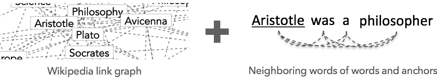

Features
========
---

Wikipedia2Vec has two unique features that are designed to effectively learn embeddings from Wikipedia.

## Extended Skip-Gram Model to Learn Embeddings of Words and Entities

Wikipedia2Vec is based on the [Word2vec's skip-gram model](https://en.wikipedia.org/wiki/Word2vec) that learns to predict neighboring words given each word in corpora.
We extend the skip-gram model by adding the following two submodels:

- *The link graph model* that learns to estimate neighboring entities given an entity in the link graph of Wikipedia entities.
- *The anchor context model* that learns to predict neighboring words given an entity by using a link that points to the entity and its neighboring words.

By jointly optimizing the skip-gram model and these two submodels, our model simultaneously learns the embedding of words and entities from Wikipedia.
For further details, please refer to our paper: [Joint Learning of the Embedding of Words and Entities for Named Entity Disambiguation](https://arxiv.org/abs/1601.01343).

## Automatic Generation of Entity Links

Many entity names in Wikipedia do not appear as links because Wikipedia instructs its contributors [to link an entity name if it is the first occurrence in the page](https://en.wikipedia.org/wiki/Wikipedia:Manual_of_Style/Linking#Principles).
This is problematic for our model because the anchor context model depends on entity links to generate contextual words of entities.

To address this, we implement a feature that automatically links entity names that do not appear as links.
In particular, it takes all words and phrases, and treats them as candidates of entity names if they exist in the *Mention DB* that contains mapping of an entity name (e.g., “Washington”) to a set of possible referent entities (e.g., Washington, D.C. and George Washington).
Then, it converts an entity name to a link pointing to an entity if the entity name is unambiguous (i.e., there is only one referent entity associated to the entity name in the DB) or the entity is referred by an entity link in the same page.
