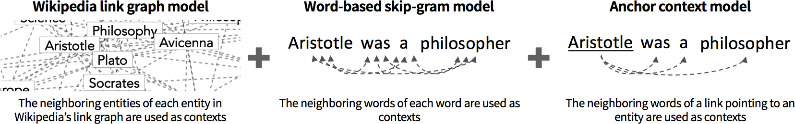

# Introduction

Embeddings (or vector representations) of lexical items (e.g., words and
entities) have been ubiquitously applied to recent NLP models. They map lexical
items into a continuous vector space, which enables them to be easily used as
features in machine learning models. Wikipedia is a multi-lingual knowledge base
(KB) containing a large amount of textual and structured data, and it is
frequently used to train embeddings [@Pennington2014; @Yamada2016; @TACL999;
@grave2018learning].

In this work, we present Wikipedia2Vec, a tool for learning embeddings of words
and entities[^1] from Wikipedia. This tool enables users to efficiently learn
quality embeddings by running a single command, using a publicly available
Wikipedia dump as input. The uniqueness of this tool is that it learns
embeddings of words and entities _simultaneously_, and places similar words and
entities close to one another in a continuous vector space. This tool implements
the conventional skip-gram model [@Mikolov2013; @Mikolov2013a] to learn the
embeddings of words, and its extension proposed in @Yamada2016 to learn the
embeddings of entities. This tool has been used in several recent
state-of-the-art NLP models such as entity linking [@Yamada2016;
@eshel-EtAl:2017:CoNLL], named entity recognition [@sato-EtAl:2017:I17-2],
knowledge base completion [@shah2019open], and question answering
[@10.1007/978-3-319-94042-7_10].

The source code has been tested on Linux, Windows, and macOS, and released under
the Apache License 2.0. The code, documentation, and pretrained embeddings for
12 languages (English, Arabic, Chinese, Dutch, French, German, Italian,
Japanese, Polish, Portuguese, Russian, and Spanish) have been publicized at
[http://wikipedia2vec.github.io](http://wikipedia2vec.github.io).

# Overview



Wikipedia2Vec is an easy-to-use, optimized tool for learning embeddings of words
and entities from Wikipedia. It learns embeddings of words and entities by
iterating over entire Wikipedia pages and jointly optimizing the following three
submodels (see also the figure above):

- _Wikipedia link graph model_, which learns entity embeddings by predicting
  neighboring entities in Wikipedia's link graph, an undirected graph whose
  nodes are entities and edges represent links between entities, based on each
  entity in Wikipedia. Here, an edge is created between a pair of entities if
  the page of one entity has a link to that of the other entity or if both pages
  link to each other.

- _Word-based skip-gram model_, which learns word embeddings by predicting
  neighboring words given each word in a text contained on a Wikipedia page.

- _Anchor context model_, which aims to place similar words and entities near
  one another in the vector space, and to create interactions between embeddings
  of words and those of entities. Here, we obtain referent entities and their
  neighboring words from links contained in a Wikipedia page, and the model
  learns embeddings by predicting neighboring words given each entity.

These three submodels are based on the skip-gram model [@Mikolov2013;
@Mikolov2013a], which is a neural network model with a training objective to
find embeddings that are useful for predicting context items (i.e., neighboring
words or entities) given a target item. For further details of these submodels,
see @Mikolov2013, @Mikolov2013a, and @Yamada2016.

## Learning Embeddings Using Wikipedia2Vec

Wikipedia2Vec can be installed via PyPI (`pip install wikipedia2vec`). With this
tool, embeddings can be learned by running a `train` command with a Wikipedia
dump as input. For example, the following commands download the latest English
Wikipedia dump and learn embeddings from this dump:

```bash
% wget https://dumps.wikimedia.org/enwiki/latest/enwiki-latest-pages-articles.xml.bz2
% wikipedia2vec train enwiki-latest-pages-articles.xml.bz2 MODEL_FILE
```

Then, the learned embeddings are written to `MODEL_FILE`. Note that this command
can take many optional parameters; details are provided in our documentation.

## Optimized Implementation for Learning Embeddings

Wikipedia2Vec is implemented in Python, and most of its code is converted into
C++ using Cython to boost its performance. Linear algebraic operations required
to learn embeddings are performed by Basic Linear Algebra Subprograms (BLAS). We
store the embeddings as a float matrix in a shared memory space and update it in
parallel using multiple processes.

## Automatic Generation of Links

One challenge is that many entity names do not appear as links in Wikipedia.
This is because Wikipedia instructs its contributors to create a link only when
the name first occurs on the page. This is problematic because Wikipedia2Vec
uses links as a source to learn embeddings. To address this, our tool
automatically generates links as follows: It first creates a dictionary that
maps each entity name to its possible referent entities. This is done by
extracting all names and their referring entities from all links contained in
Wikipedia. Then, during training, our tool takes all words and phrases from the
target page and converts each into a link to an entity, if the entity is
referred by a link on the same page, or if there is only one referent entity
associated to the name in the dictionary.

# Empirical Comparison with Existing Tools

In this section, we compare our tool with two types of existing tools: (1) tools
to learn entity embeddings, and (2) tools to learn word embeddings.

To evaluate the quality of the entity embeddings, we used the entity relatedness
task with the KORE entity relatedness data set [@Hoffart2012]. We report
Spearman's rank correlation coefficient between human judgment scores and the
cosine similarity between the entity embeddings. For baselines, we use two
state-of-the-art entity embedding models implemented in the RDF2Vec
[@ristoski2018rdf2vec] and [Wiki2vec](https://github.com/idio/wiki2vec) tools.

Furthermore, we employ two standard tasks to evaluate the quality of the
embeddings of words: (1) a word analogy task using the semantic subset (G-SEM)
and the syntactic subset (G-SYN) of the Google Word Analogy data set
[@Mikolov2013], and (2) a word similarity task using two standard data sets,
namely SimLex-999 (SL999) [@Hill:2015:SES:2893320.2893324] and WordSim-353
(WS353) [@Finkelstein2002]. The word analogy task consists of questions of the
form "_a_ is to _b_ as _c_ is to _d_," where _a_, _b_, and _c_ are the question
words, and _d_ is the answer word that must be predicted by the models.
Following previous work [@Mikolov2013], we addressed this by finding _d_ whose
embedding $w_d$ is closest to $w_b - w_a + w_c$ according to the cosine
similarity, and reported the accuracy. Regarding the word similarity task, we
report Spearman's rank correlation coefficient between human judgment scores and
the cosine similarity between word embeddings. As baselines for these tasks, we
use the skip-gram model [@Mikolov2013] implemented in the Gensim library 3.6.0
[@rehurek_lrec] and the extended skip-gram model implemented in the FastText
tool 0.1.0 [@TACL999]. To create the training corpus for the baseline models, we
extracted texts from the Wikipedia dump using
[WikiExtractor](https://github.com/attardi/wikiextractor). We also report the
time required for training based on the dump. Additionally, to the extent
possible, we use the same hyper-parameters to train our models and the baseline
models. [^2]

We conducted all experiments using Ubuntu Server 16.04 LTS with Python 3.5 and
OpenBLAS 0.3.3 installed on the c5d.9xlarge instance with 36 CPU cores deployed
on Amazon Web Services. To train our models and the baseline models of word
embeddings, we used the April 2018 version of the English Wikipedia dump.

## Results

| Model                           | KORE     | G-SEM    | G-SYN    | SL999    | WS353    | Time   |
| ------------------------------- | -------- | -------- | -------- | -------- | -------- | ------ |
| Wikipedia2Vec                   | **0.71** | **0.79** | 0.68     | **0.40** | 0.71     | 276min |
| Wikipedia2Vec (_w/o autolink_)  | 0.69     | **0.79** | 0.67     | 0.39     | **0.72** | 211min |
| Wikipedia2Vec (_w/o linkgraph_) | 0.61     | 0.77     | 0.67     | 0.39     | 0.70     | 170min |
| RDF2Vec                         | 0.69     | \-       | \-       | \-       | \-       | \-     |
| Wiki2vec                        | 0.52     | \-       | \-       | \-       | \-       | \-     |
| Gensim                          | \-       | 0.75     | 0.67     | 0.37     | 0.70     | 197min |
| FastText                        | \-       | 0.63     | **0.70** | 0.37     | 0.69     | 243min |

Table: Empirical results of Wikipedia2Vec and the baselines.

In the above table, we provide the comparison of our models with the baseline
models in terms of the performance of the tasks described above, as well as the
time needed for training. We obtained the results of the RDF2Vec and Wiki2vec
models from @ristoski2018rdf2vec. Here, _w/o autolink_ and _w/o linkgraph_ stand
for the model without using automatic generation of links and the Wikipedia link
graph model, respectively.

Overall, our model provided enhanced performance. It outperformed the RDF2Vec
and Wiki2vec models and achieved a new state-of-the-art result on the KORE data
set. Furthermore, the feature of automatic link generation and the Wikipedia
link graph model improved performance with the KORE data set. Moreover, our
model performed better than the baseline word embedding models on one out of two
word analogy data sets, as well as on both word similarity data sets. This
demonstrates that the semantic signals of entities provided by the Wikipedia
link graph and anchor context models are beneficial for improving the quality of
word embeddings.

The training time of our model was comparable to that of the baseline word
embedding models. Furthermore, our _w/o linkgraph_ model was the fastest among
the models and also achieved competitive performance on the word similarity and
word analogy tasks.

[^1]:

  In this paper, entities refer to concepts that have corresponding pages in
  Wikipedia.

[^2]:

  We used the following settings: $dim\_size=500$, $window=5$, $negative=5$,
  $iteration=5$

# References
